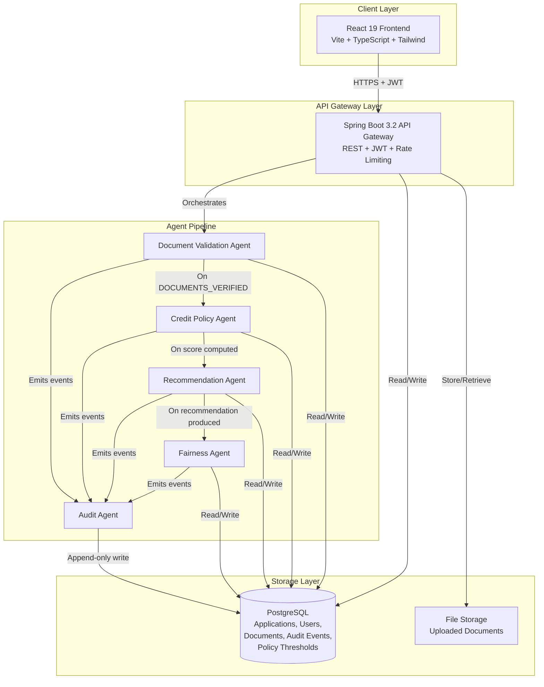
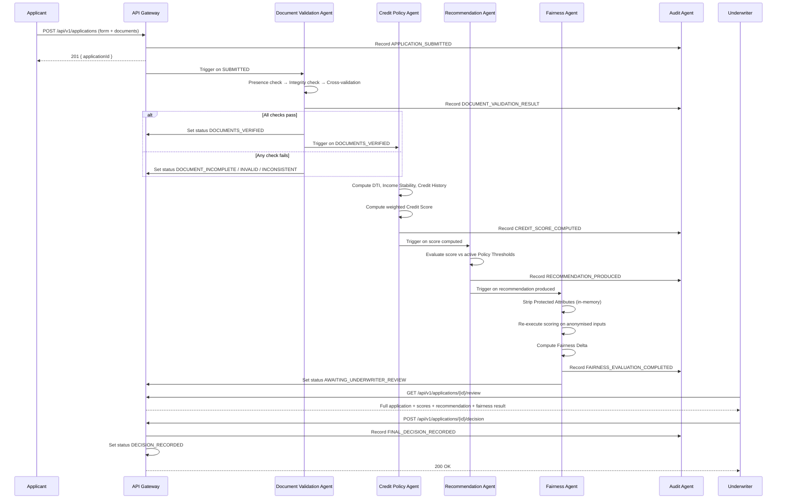
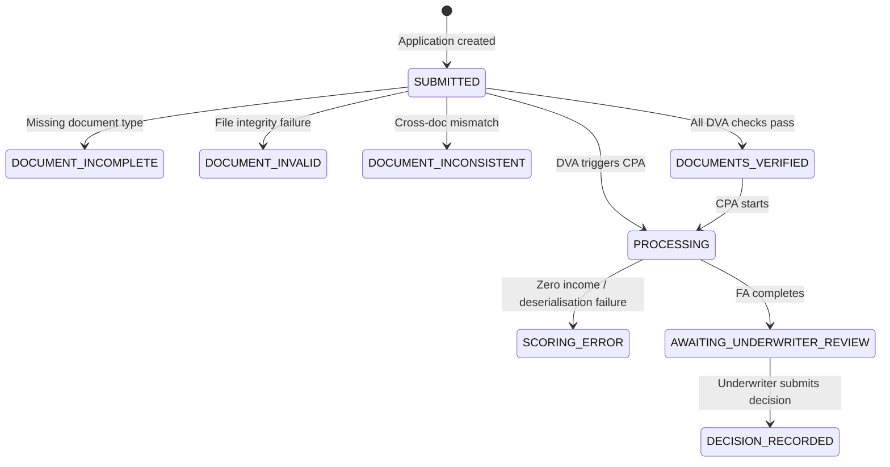
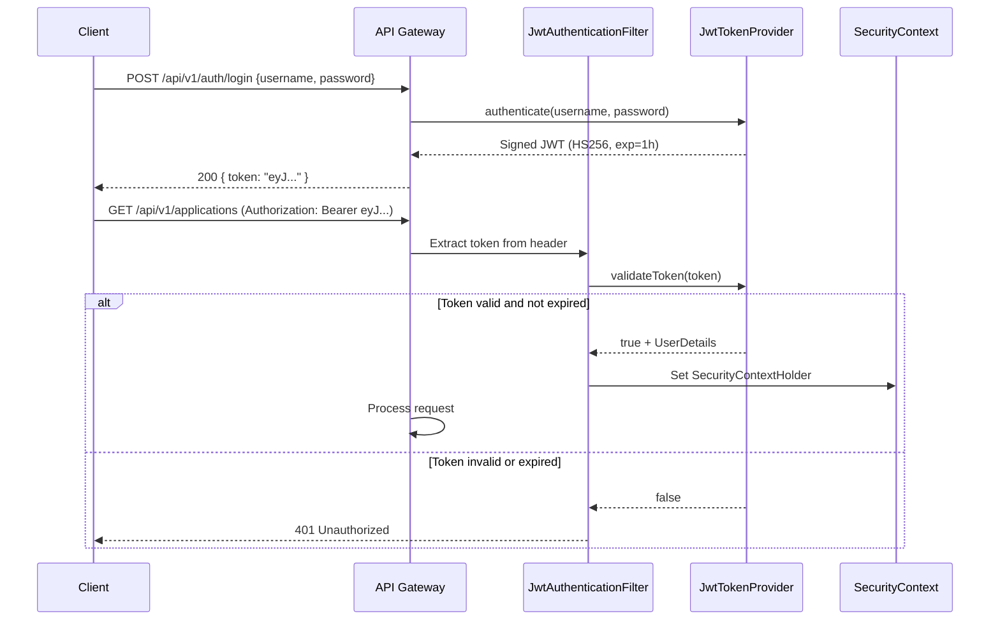

# Design Document — AI-Powered Loan / Credit Application Processing Agent

## Overview

The AI-powered Loan / Credit Application Processing Agent is an enterprise-grade automation layer built on the existing TechVest AI platform. It orchestrates five specialised agents — Document Validation, Credit Policy, Recommendation, Fairness, and Audit — to carry out a transparent, rules-based preliminary assessment of every loan or credit application before a human Underwriter makes the final binding decision.

The system is deliberately not a black-box ML model. Every scoring step follows explicit, configurable policy rules so that the Underwriter, the applicant, and a regulator can trace any outcome back to its exact inputs and weights. The Fairness Agent re-scores each application on anonymised inputs to detect demographically driven bias before the file reaches the Underwriter. An append-only Audit Log captures every agent action, input, output, and timestamp to meet regulatory obligations.

### Key design principles

- **Human-in-the-loop**: agents produce recommendations; only an authenticated Underwriter records the final decision.
- **Transparency by design**: every sub-score, weight, and policy version is stored and surfaced to the Underwriter.
- **Append-only audit**: no audit row can be updated or deleted once written.
- **Fail-fast validation**: the pipeline halts at the earliest detectable error and records the reason.
- **Separation of concerns**: each agent has a single, well-defined responsibility and communicates through the Application record and event payloads.

---

## Architecture

### High-Level Architecture



### Agent Pipeline Flow



---

## Components and Interfaces

### Backend Component Breakdown

```
com.techvestai.project
├── config
│   ├── SecurityConfig.java           — Spring Security, JWT filter, CORS, rate limiting
│   ├── JwtConfig.java                — JWT secret validation at startup
│   └── OpenApiConfig.java            — Swagger / OpenAPI 3 configuration
│
├── controller
│   ├── AuthController.java           — POST /api/v1/auth/login
│   ├── ApplicationController.java    — Application CRUD and status endpoints
│   ├── DocumentController.java       — Multipart document upload
│   ├── DecisionController.java       — Underwriter decision submission
│   ├── PolicyController.java         — Policy threshold management
│   └── AuditController.java          — Audit log retrieval and export
│
├── agent
│   ├── DocumentValidationAgent.java  — Presence, integrity, cross-doc validation
│   ├── CreditPolicyAgent.java        — DTI, income stability, credit history scoring
│   ├── RecommendationAgent.java      — Score-to-recommendation mapping
│   ├── FairnessAgent.java            — Anonymisation and delta computation
│   └── AuditAgent.java               — Append-only event persistence
│
├── service
│   ├── ApplicationService.java       — Application lifecycle orchestration
│   ├── DocumentService.java          — File storage and metadata persistence
│   ├── PolicyThresholdService.java   — Threshold versioning
│   ├── UserService.java              — User management
│   └── RateLimitService.java         — Per-user request counting (in-memory)
│
├── repository
│   ├── ApplicationRepository.java
│   ├── DocumentRepository.java
│   ├── AuditEventRepository.java
│   ├── PolicyThresholdRepository.java
│   └── UserRepository.java           (existing)
│
├── entity
│   ├── User.java                     (existing — to be extended with roles)
│   ├── Application.java
│   ├── Document.java
│   ├── AuditEvent.java
│   ├── PolicyThreshold.java
│   └── UnderwriterDecision.java
│
├── dto
│   ├── request/
│   │   ├── LoginRequest.java
│   │   ├── ApplicationSubmitRequest.java
│   │   ├── UnderwriterDecisionRequest.java
│   │   └── PolicyThresholdRequest.java
│   └── response/
│       ├── AuthResponse.java
│       ├── ApplicationStatusResponse.java
│       ├── ApplicationReviewResponse.java
│       ├── CreditScoreBreakdown.java
│       ├── FairnessResultResponse.java
│       └── AuditEventResponse.java
│
├── security
│   ├── JwtTokenProvider.java         — Token generation and validation
│   ├── JwtAuthenticationFilter.java  — Per-request JWT extraction
│   └── UserPrincipal.java            — Spring Security principal wrapper
│
└── exception
    ├── GlobalExceptionHandler.java   — @ControllerAdvice error mapping
    ├── DocumentValidationException.java
    ├── ScoringException.java
    └── UnauthorisedResourceException.java
```

### Frontend Component Hierarchy

```
src/
├── main.tsx
├── App.tsx                        — Router + auth context provider
│
├── contexts/
│   ├── AuthContext.tsx            — In-memory JWT storage, role extraction
│   └── ApiContext.tsx             — Axios instance with JWT interceptor
│
├── pages/
│   ├── LoginPage.tsx
│   ├── applicant/
│   │   ├── DashboardPage.tsx      — Application status overview
│   │   ├── SubmitApplicationPage.tsx
│   │   └── ApplicationStatusPage.tsx
│   └── underwriter/
│       ├── WorklistPage.tsx       — Paginated AWAITING_UNDERWRITER_REVIEW list
│       └── ReviewPage.tsx         — Full review detail + decision form
│
├── components/
│   ├── common/
│   │   ├── ProtectedRoute.tsx     — Role-based route guard
│   │   ├── ErrorMessage.tsx       — User-readable error display
│   │   ├── LoadingSpinner.tsx
│   │   └── Navbar.tsx
│   ├── applicant/
│   │   ├── ApplicationForm.tsx    — Loan amount, purpose, income fields
│   │   └── DocumentUpload.tsx     — File type + size validation before submit
│   └── underwriter/
│       ├── CreditScoreCard.tsx    — Sub-scores with weights
│       ├── RecommendationBadge.tsx
│       ├── FairnessResultPanel.tsx
│       └── DecisionForm.tsx       — Decision value + justification (≥20 chars)
│
└── services/
    ├── authService.ts
    ├── applicationService.ts
    ├── documentService.ts
    └── auditService.ts
```

### REST API Endpoint Specification

| Method | Path | Roles | Description |
|--------|------|-------|-------------|
| POST | `/api/v1/auth/login` | Public | Authenticate and receive JWT |
| POST | `/api/v1/applications` | APPLICANT | Submit application form |
| POST | `/api/v1/applications/{id}/documents` | APPLICANT | Upload documents (multipart) |
| GET | `/api/v1/applications/{id}/status` | APPLICANT | Own application status |
| GET | `/api/v1/applications` | UNDERWRITER, ADMIN | List applications (paginated) |
| GET | `/api/v1/applications/{id}/review` | UNDERWRITER | Full review payload |
| POST | `/api/v1/applications/{id}/decision` | UNDERWRITER | Submit final decision |
| GET | `/api/v1/policies` | UNDERWRITER, ADMIN | List all policy thresholds |
| POST | `/api/v1/policies` | ADMIN | Create new active threshold |
| GET | `/api/v1/audit/{applicationId}` | UNDERWRITER, ADMIN | Audit trail for application |
| GET | `/api/v1/audit/export` | ADMIN | Export audit events by date range |
| GET | `/api/v1/admin/users` | ADMIN | List users |
| POST | `/api/v1/admin/users` | ADMIN | Create user |

---

## Data Models

### Entity Relationship Diagram

```mermaid
erDiagram
    users {
        BIGSERIAL id PK
        VARCHAR(100) username UK NOT_NULL
        VARCHAR(255) password NOT_NULL
        VARCHAR(255) email
        VARCHAR(20) role NOT_NULL
        TIMESTAMP created_at NOT_NULL
        BOOLEAN enabled NOT_NULL
    }

    applications {
        UUID id PK
        BIGINT applicant_id FK NOT_NULL
        DECIMAL(15_2) requested_amount NOT_NULL
        VARCHAR(200) loan_purpose NOT_NULL
        VARCHAR(50) employment_status NOT_NULL
        DECIMAL(15_2) gross_monthly_income NOT_NULL
        DECIMAL(15_2) total_monthly_debt NOT_NULL
        VARCHAR(50) status NOT_NULL
        TIMESTAMP created_at NOT_NULL
        TIMESTAMP updated_at NOT_NULL
    }

    documents {
        UUID id PK
        UUID application_id FK NOT_NULL
        VARCHAR(50) document_type NOT_NULL
        VARCHAR(255) original_filename NOT_NULL
        VARCHAR(100) mime_type NOT_NULL
        BIGINT file_size_bytes NOT_NULL
        VARCHAR(512) storage_path NOT_NULL
        TIMESTAMP uploaded_at NOT_NULL
        VARCHAR(50) validation_status
        TEXT validation_failure_reason
    }

    credit_scores {
        UUID id PK
        UUID application_id FK UK NOT_NULL
        DECIMAL(7_2) credit_score NOT_NULL
        DECIMAL(5_2) dti_ratio NOT_NULL
        INTEGER dti_sub_score NOT_NULL
        INTEGER income_stability_score NOT_NULL
        INTEGER credit_history_score NOT_NULL
        DECIMAL(4_2) dti_weight NOT_NULL
        DECIMAL(4_2) income_stability_weight NOT_NULL
        DECIMAL(4_2) credit_history_weight NOT_NULL
        UUID policy_threshold_id FK NOT_NULL
        TIMESTAMP computed_at NOT_NULL
    }

    recommendations {
        UUID id PK
        UUID application_id FK UK NOT_NULL
        VARCHAR(30) recommendation_value NOT_NULL
        UUID policy_threshold_id FK NOT_NULL
        TEXT explanation NOT_NULL
        TIMESTAMP produced_at NOT_NULL
    }

    fairness_results {
        UUID id PK
        UUID application_id FK UK NOT_NULL
        DECIMAL(7_2) original_credit_score NOT_NULL
        DECIMAL(7_2) anonymised_credit_score NOT_NULL
        DECIMAL(7_2) fairness_delta NOT_NULL
        VARCHAR(30) fairness_outcome NOT_NULL
        TEXT flag_reason
        TIMESTAMP evaluated_at NOT_NULL
    }

    underwriter_decisions {
        UUID id PK
        UUID application_id FK UK NOT_NULL
        BIGINT underwriter_id FK NOT_NULL
        VARCHAR(30) decision_value NOT_NULL
        TEXT justification_text NOT_NULL
        TEXT override_reason
        VARCHAR(30) system_recommendation NOT_NULL
        TIMESTAMP decided_at NOT_NULL
    }

    policy_thresholds {
        UUID id PK
        INTEGER approve_threshold NOT_NULL
        INTEGER refer_threshold NOT_NULL
        VARCHAR(20) status NOT_NULL
        TIMESTAMP created_at NOT_NULL
        BIGINT created_by FK NOT_NULL
    }

    audit_events {
        UUID event_id PK
        UUID application_id FK NOT_NULL
        VARCHAR(60) event_type NOT_NULL
        JSONB event_payload NOT_NULL
        VARCHAR(100) actor NOT_NULL
        TIMESTAMP created_at NOT_NULL
    }

    document_extraction_payloads {
        UUID id PK
        UUID application_id FK UK NOT_NULL
        JSONB extracted_fields NOT_NULL
        VARCHAR(50) extraction_status NOT_NULL
        TIMESTAMP extracted_at NOT_NULL
    }

    users ||--o{ applications : "submits"
    applications ||--o{ documents : "has"
    applications ||--o| credit_scores : "has"
    applications ||--o| recommendations : "has"
    applications ||--o| fairness_results : "has"
    applications ||--o| underwriter_decisions : "has"
    applications ||--o| document_extraction_payloads : "has"
    applications ||--o{ audit_events : "generates"
    credit_scores }o--|| policy_thresholds : "uses"
    recommendations }o--|| policy_thresholds : "cites"
    policy_thresholds }o--|| users : "created_by"
    underwriter_decisions }o--|| users : "made_by"
```

### Key DTO Definitions

**ApplicationSubmitRequest**
```java
public record ApplicationSubmitRequest(
    @NotNull @DecimalMin("1.00") BigDecimal requestedAmount,
    @NotBlank @Size(max = 200) String loanPurpose,
    @NotNull EmploymentStatus employmentStatus,
    @NotNull @DecimalMin("0.01") BigDecimal grossMonthlyIncome,
    @NotNull @DecimalMin("0.00") BigDecimal totalMonthlyDebt
) {}
```

**ApplicationReviewResponse**
```java
public record ApplicationReviewResponse(
    UUID applicationId,
    String status,
    ApplicationFormData formData,
    List<DocumentMetadata> documents,
    CreditScoreBreakdown creditScore,
    RecommendationDetail recommendation,
    FairnessResultResponse fairnessResult,
    boolean hasFairnessFlag,
    String fairnessFlagReason
) {}
```

**CreditScoreBreakdown**
```java
public record CreditScoreBreakdown(
    BigDecimal creditScore,
    BigDecimal dtiRatio,
    int dtiSubScore,
    int incomeStabilityScore,
    int creditHistoryScore,
    BigDecimal dtiWeight,
    BigDecimal incomeStabilityWeight,
    BigDecimal creditHistoryWeight,
    UUID policyThresholdId,
    Instant computedAt
) {}
```

**UnderwriterDecisionRequest**
```java
public record UnderwriterDecisionRequest(
    @NotNull DecisionValue decisionValue,
    @NotBlank @Size(min = 20, max = 5000) String justificationText,
    @Size(max = 2000) String overrideReason
) {}
```

**DocumentExtractionPayload** (stored as JSONB)
```json
{
  "applicantName": "string",
  "dateOfBirth": "ISO-8601 date",
  "grossMonthlyIncome": "decimal",
  "consecutiveIncomeMonths": "integer",
  "onTimeRepaymentRatio": "decimal",
  "extractedAt": "ISO-8601 datetime"
}
```

### Application Status State Machine



---

## Correctness Properties

*A property is a characteristic or behavior that should hold true across all valid executions of a system — essentially, a formal statement about what the system should do. Properties serve as the bridge between human-readable specifications and machine-verifiable correctness guarantees.*

**Property reflection notes**: After reviewing all testable criteria, the following consolidations were made:
- DTI sub-score, Income Stability sub-score, and Credit History sub-score mappings (4.3, 4.4, 4.5) are three separate pure band-mapping functions; they are kept as one consolidated property covering all three sub-score computations since they share the same structural pattern.
- The specific threshold band instantiations (5.2, 5.3, 5.4) are edge cases already covered by the general recommendation-matches-threshold property (5.1).
- Audit event structure (8.1) and audit uniqueness (8.5) are merged into one comprehensive audit integrity property.
- Credit score persistence (4.7) and decision persistence (7.5) are both round-trip storage properties but for different entities; they remain separate.

---

### Property 1: JWT Expiry Rejection

*For any* JWT token, if the token's expiry timestamp is at or before the current system time, the `JwtTokenProvider.validateToken()` method SHALL return false, regardless of all other token fields being valid.

**Validates: Requirements 1.3**

---

### Property 2: Role-Based Access Denial

*For any* authenticated user holding role R and any API endpoint that requires role R′, if R ≠ R′ (and no role hierarchy applies), the request SHALL be rejected with HTTP 403.

**Validates: Requirements 1.4**

---

### Property 3: Valid Application Submission Creates SUBMITTED Record

*For any* application form containing all required fields (requestedAmount > 0, loanPurpose non-blank, employmentStatus non-null, grossMonthlyIncome > 0, totalMonthlyDebt ≥ 0), submitting it as an authenticated APPLICANT SHALL result in a new Application record with status SUBMITTED and a non-null applicationId returned.

**Validates: Requirements 2.1**

---

### Property 4: Missing Required Fields Returns 422

*For any* non-empty subset of the five required application form fields that is omitted from the submission, the API Gateway SHALL return HTTP 422 with a field-level error message identifying each missing field.

**Validates: Requirements 2.2**

---

### Property 5: DTI Computation Correctness

*For any* pair of values (grossMonthlyIncome > 0, totalMonthlyDebt ≥ 0), the Credit Policy Agent's DTI computation SHALL produce a value equal to `totalMonthlyDebt / grossMonthlyIncome`, with no rounding error beyond two decimal places.

**Validates: Requirements 4.1**

---

### Property 6: Sub-Score Band Mapping Correctness

*For any* valid input to each sub-score mapping function:
- DTI sub-score: any DTI value in [0, ∞) SHALL map to the correct band score (≤0.20 → 100, 0.21–0.35 → 80, 0.36–0.43 → 60, 0.44–0.50 → 40, >0.50 → 0).
- Income Stability Score: any consecutive months value SHALL map correctly (≥24 → 100, 12–23 → 70, 6–11 → 40, <6 → 0).
- Credit History Score: any repayment ratio in [0, 1] SHALL map correctly (≥0.95 → 100, 0.80–0.94 → 75, 0.65–0.79 → 50, <0.65 → 20).

**Validates: Requirements 4.3, 4.4, 4.5**

---

### Property 7: Weighted Credit Score Formula Correctness

*For any* valid triple (dtiSubScore ∈ [0,100], incomeStabilityScore ∈ [0,100], creditHistoryScore ∈ [0,100]), the final Credit Score SHALL equal `(dtiSubScore × 0.40 + incomeStabilityScore × 0.35 + creditHistoryScore × 0.25) × 10`, clamped to [0, 1000].

**Validates: Requirements 4.6**

---

### Property 8: Recommendation Matches Active Policy Threshold

*For any* credit score S and any valid Policy Threshold configuration (approveThreshold > referThreshold, both in [0, 1000]):
- S ≥ approveThreshold → Recommendation = APPROVE
- referThreshold ≤ S < approveThreshold → Recommendation = REFER
- S < referThreshold → Recommendation = DECLINE

No other recommendation value is permitted.

**Validates: Requirements 5.1, 5.2, 5.3, 5.4**

---

### Property 9: Recommendation Explanation Contains All Required Fields

*For any* recommendation output produced by the Recommendation Agent, the explanation field SHALL contain the name, value, weight, and contribution of every scoring factor used in the Credit Score computation.

**Validates: Requirements 5.6**

---

### Property 10: Fairness Delta Is Absolute Difference

*For any* pair (originalCreditScore, anonymisedCreditScore), the Fairness Agent SHALL compute `fairnessDelta = |originalCreditScore − anonymisedCreditScore|`. The delta SHALL always be non-negative.

**Validates: Requirements 6.3**

---

### Property 11: Fairness Flag Threshold (≥ 50 triggers flag)

*For any* fairness delta d:
- d ≥ 50 → fairnessOutcome = FAIRNESS_FLAG with reason POTENTIAL_BIAS_DETECTED
- d < 50 → fairnessOutcome = FAIRNESS_PASSED

The boundary value d = 50 SHALL trigger FAIRNESS_FLAG.

**Validates: Requirements 6.4, 6.5**

---

### Property 12: Fairness Agent Does Not Mutate Original Scores

*For any* application, after the Fairness Agent completes its evaluation, the original creditScore and recommendation values stored on the application record SHALL be identical to their values before the Fairness Agent ran.

**Validates: Requirements 6.6**

---

### Property 13: Decision Accepted Iff Justification Length ≥ 20

*For any* string submitted as justification text:
- length ≥ 20 characters → decision submission is accepted (HTTP 200)
- length < 20 characters → decision submission is rejected (HTTP 422)

**Validates: Requirements 7.3, 7.4**

---

### Property 14: Decided Application Is Immutable

*For any* application in DECISION_RECORDED status, any attempt to modify the application record, decision, Credit Score, or Recommendation SHALL be rejected.

**Validates: Requirements 7.7**

---

### Property 15: Audit Event Integrity — Structure and Uniqueness

*For any* collection of audit events inserted by the Audit Agent:
- Every event SHALL contain: event_id (UUID), application_id, event_type, event_payload (non-null JSON), actor, created_at (UTC).
- All event_id values in the collection SHALL be distinct (globally unique UUIDs).
- No event SHALL be updatable or deletable after insertion.

**Validates: Requirements 8.1, 8.2, 8.5**

---

### Property 16: Policy Threshold Validity — Approve > Refer

*For any* pair (approveThreshold, referThreshold), the policy creation endpoint SHALL:
- Accept the pair and create an ACTIVE record iff approveThreshold > referThreshold.
- Reject the pair with HTTP 422 iff approveThreshold ≤ referThreshold.

**Validates: Requirements 9.2**

---

### Property 17: Exactly One Active Policy Threshold at All Times

*For any* sequence of policy threshold creation operations, after each operation completes, exactly one Policy Threshold record SHALL have status ACTIVE; all others SHALL have status SUPERSEDED.

**Validates: Requirements 9.3**

---

### Property 18: Applicant Cannot Access Other Applicants' Applications

*For any* authenticated APPLICANT user U and any applicationId A that was not created by U, a request for the status of A SHALL return HTTP 404 with no application data exposed.

**Validates: Requirements 10.3**

---

### Property 19: APPLICANT Response Contains No Restricted Fields

*For any* application status response returned to an APPLICANT-role user, the response payload SHALL not contain: creditScore, dtiSubScore, incomeStabilityScore, creditHistoryScore, fairnessResult, fairnessDelta, auditEvents, or underwriterJustification.

**Validates: Requirements 10.5**

---

### Property 20: Document Extraction Payload Round-Trip

*For any* valid `DocumentExtractionPayload` object, serialising it to JSON and then deserialising that JSON back to a `DocumentExtractionPayload` SHALL produce an object that is semantically equivalent to the original (all field values equal).

**Validates: Requirements 12.3**

---

### Property 21: Rate Limiting Enforced at > 100 Requests per Minute

*For any* authenticated user who has made more than 100 requests within a 60-second sliding window, the next request to any rate-limited endpoint SHALL receive HTTP 429 with a `Retry-After` header present.

**Validates: Requirements 13.6**

---

### Property 22: Frontend File Upload Client-Side Validation

*For any* file selected in the document upload interface:
- file.size > 10,485,760 bytes (10 MB) → form submission SHALL be prevented before any API call is made.
- file.type not in {application/pdf, image/jpeg, image/png} → form submission SHALL be prevented.

**Validates: Requirements 11.4**

---

### Property 23: Frontend Decision Form Submission Guard

*For any* string typed into the justification text field of the decision submission form, the submit button SHALL be enabled if and only if the string length is ≥ 20 characters.

**Validates: Requirements 11.8**

---

## Security Design

### JWT Authentication Flow



### RBAC Matrix

| Endpoint Pattern | APPLICANT | UNDERWRITER | ADMIN |
|-----------------|-----------|-------------|-------|
| POST /auth/login | ✓ | ✓ | ✓ |
| POST /applications | ✓ | — | — |
| GET /applications/{id}/status | own only | ✓ | ✓ |
| GET /applications/{id}/review | — | ✓ | ✓ |
| POST /applications/{id}/decision | — | ✓ | — |
| GET /policies | — | ✓ | ✓ |
| POST /policies | — | — | ✓ |
| GET /audit/{applicationId} | — | ✓ | ✓ |
| GET /audit/export | — | — | ✓ |
| GET /admin/users | — | — | ✓ |
| POST /admin/users | — | — | ✓ |

### Rate Limiting Design

Rate limiting is enforced at the API Gateway level using a sliding-window in-memory counter per authenticated user identifier.

- **Limit**: 100 requests per 60-second sliding window.
- **Response on breach**: HTTP 429 with `Retry-After: <seconds until window resets>` header.
- **Implementation**: `RateLimitService` using a `ConcurrentHashMap<userId, Deque<Instant>>`. On each request, prune entries older than 60 seconds; if remaining count > 100, reject.
- **Scope**: Applied after JWT authentication succeeds. Unauthenticated requests are rejected at 401 before reaching the rate limiter.

### JWT Startup Security Check

At application startup, `JwtConfig` checks for the `JWT_SECRET` environment variable. If absent or shorter than 32 characters, the application refuses to start:

```java
@PostConstruct
public void validateSecret() {
    String secret = env.getProperty("JWT_SECRET");
    if (secret == null || secret.length() < 32) {
        throw new IllegalStateException(
            "JWT_SECRET environment variable is required and must be at least 32 characters"
        );
    }
}
```

### Document Storage Security

- Storage paths are generated as `{configured-base-dir}/{UUID}/{sanitised-filename}` where the UUID is generated at upload time, making paths non-predictable and non-enumerable.
- File content is streamed to storage without reading into memory beyond buffered chunks to prevent memory exhaustion.
- MIME type validation is performed on both the `Content-Type` header and the file's magic bytes (first 8 bytes) to prevent MIME-type spoofing.

### Protected Attribute Handling (Fairness Agent)

The Fairness Agent creates a transient in-memory copy of the financial inputs only:

```java
FinancialInputs anonymised = FinancialInputs.builder()
    .grossMonthlyIncome(original.getGrossMonthlyIncome())
    .totalMonthlyDebt(original.getTotalMonthlyDebt())
    .consecutiveIncomeMonths(original.getConsecutiveIncomeMonths())
    .onTimeRepaymentRatio(original.getOnTimeRepaymentRatio())
    // Protected attributes deliberately excluded
    .build();
```

Protected attributes (name, national ID, gender, DOB, ethnicity, address) are never included in the `anonymised` object, never logged, and the object is eligible for GC immediately after the delta is computed. No persistence call is made with protected attribute data during this step.

---

## Error Handling

### Global Exception Mapping

All exceptions are handled by `GlobalExceptionHandler` which maps them to RFC 7807 Problem Details responses:

| Exception | HTTP Status | Body |
|-----------|-------------|------|
| `MethodArgumentNotValidException` | 422 | Field-level validation errors |
| `MultipartException` (file too large) | 413 | Max file size message |
| `UnsupportedMediaTypeException` | 415 | Accepted MIME types |
| `AccessDeniedException` | 403 | Authorisation failure message |
| `AuthenticationException` | 401 | Authentication failure message |
| `DocumentValidationException` | 422 | Validation failure detail |
| `ScoringException` | 422 | Scoring error reason |
| `UnauthorisedResourceException` | 404 | No data exposed |
| `TooManyRequestsException` | 429 | Retry-After header set |
| `Exception` (catch-all) | 500 | Generic message, no stack trace |

### Agent Pipeline Halt Points

Each agent halts the pipeline and records the reason in the Application record when:

| Agent | Halt Condition | Status Set |
|-------|---------------|------------|
| Document Validation | Missing document type | DOCUMENT_INCOMPLETE |
| Document Validation | Integrity failure | DOCUMENT_INVALID |
| Document Validation | Cross-doc mismatch | DOCUMENT_INCONSISTENT |
| Credit Policy | Zero gross monthly income | SCORING_ERROR (ZERO_INCOME) |
| Credit Policy | Payload deserialisation failure | SCORING_ERROR (PAYLOAD_DESERIALISATION_FAILURE) |

After any halt, the Audit Agent records the appropriate event before the thread exits.

### Frontend Error Display

The frontend never exposes raw HTTP status codes or stack traces. `ErrorMessage.tsx` maps API error responses to user-readable messages:

```typescript
const ERROR_MESSAGES: Record<number, string> = {
  401: "Your session has expired. Please log in again.",
  403: "You do not have permission to perform this action.",
  404: "The requested resource was not found.",
  413: "The uploaded file exceeds the 10 MB limit.",
  415: "The file type is not supported. Please upload a PDF, JPEG, or PNG.",
  422: "Please check the form for errors and try again.",
  429: "Too many requests. Please wait a moment before trying again.",
  500: "An unexpected error occurred. Please try again later.",
};
```

---

## Testing Strategy

### Overview

The testing strategy follows a dual-testing approach: unit/example-based tests for specific behaviors and integration points, and property-based tests for universal correctness properties. The two are complementary — unit tests catch concrete bugs in known scenarios, property tests find edge cases across the full input space.

### Property-Based Testing

**Library**: [jqwik](https://jqwik.net/) for Java 21 + Spring Boot 3.2.

**Configuration**: Each property test runs a minimum of 100 iterations (`@Property(tries = 100)`). For critical scoring properties (7, 8, 11), use 500 tries.

**Tag format**: Each property test is annotated with:
```java
@Tag("Feature: loan-credit-processing-agent, Property N: <property_text>")
```

**Property test implementation plan**:

| Property | Test Class | Method | Tries |
|----------|-----------|--------|-------|
| P1: JWT Expiry Rejection | `JwtTokenProviderPropertyTest` | `expiredTokenAlwaysInvalid` | 100 |
| P2: Role-Based Access Denial | `RbacPropertyTest` | `unauthorisedRoleAlwaysReturns403` | 100 |
| P3: Valid Submission → SUBMITTED | `ApplicationSubmissionPropertyTest` | `validSubmissionCreatesSubmittedApp` | 100 |
| P4: Missing Fields → 422 | `ApplicationSubmissionPropertyTest` | `missingFieldsReturns422` | 100 |
| P5: DTI Computation | `CreditPolicyAgentPropertyTest` | `dtiComputationIsCorrect` | 500 |
| P6: Sub-Score Band Mapping | `CreditPolicyAgentPropertyTest` | `subScoreBandMappingIsCorrect` | 500 |
| P7: Weighted Credit Score Formula | `CreditPolicyAgentPropertyTest` | `weightedCreditScoreFormulaIsCorrect` | 500 |
| P8: Recommendation Matches Threshold | `RecommendationAgentPropertyTest` | `recommendationMatchesActiveThreshold` | 500 |
| P9: Explanation Contains All Fields | `RecommendationAgentPropertyTest` | `explanationContainsAllRequiredFields` | 100 |
| P10: Fairness Delta Is Absolute Difference | `FairnessAgentPropertyTest` | `deltaIsAbsoluteDifference` | 500 |
| P11: Fairness Flag Threshold | `FairnessAgentPropertyTest` | `fairnessFlagThresholdIsCorrect` | 500 |
| P12: Fairness Does Not Mutate Originals | `FairnessAgentPropertyTest` | `fairnessAgentDoesNotMutateOriginalScores` | 100 |
| P13: Decision Justification Length | `DecisionControllerPropertyTest` | `decisionAcceptedIffJustificationLengthSufficient` | 100 |
| P14: Decided App Is Immutable | `ApplicationImmutabilityPropertyTest` | `decidedApplicationCannotBeModified` | 100 |
| P15: Audit Event Integrity | `AuditAgentPropertyTest` | `auditEventsHaveRequiredFieldsAndUniqueIds` | 100 |
| P16: Policy Threshold Approve > Refer | `PolicyThresholdPropertyTest` | `thresholdAcceptedIffApproveGreaterThanRefer` | 500 |
| P17: Exactly One Active Threshold | `PolicyThresholdPropertyTest` | `exactlyOneThresholdIsActiveAfterCreation` | 100 |
| P18: Applicant Cannot Access Others' Apps | `ApplicationAccessPropertyTest` | `applicantReceives404ForOthersApplications` | 100 |
| P19: APPLICANT Response No Restricted Fields | `ApplicationAccessPropertyTest` | `applicantResponseContainsNoRestrictedFields` | 100 |
| P20: Extraction Payload Round-Trip | `DocumentExtractionPropertyTest` | `extractionPayloadRoundTrip` | 500 |
| P21: Rate Limiting at > 100 RPM | `RateLimitServicePropertyTest` | `rateLimitEnforcedAfter100Requests` | 100 |
| P22: Frontend File Upload Validation | `DocumentUploadValidationTest` (Vitest) | `fileUploadClientValidation` | 100 |
| P23: Frontend Decision Form Guard | `DecisionFormTest` (Vitest) | `submitGuardedByJustificationLength` | 100 |

**Example property test (Property 7)**:

```java
@Property(tries = 500)
@Tag("Feature: loan-credit-processing-agent, Property 7: Weighted Credit Score Formula Correctness")
void weightedCreditScoreFormulaIsCorrect(
    @ForAll @IntRange(min = 0, max = 100) int dtiSubScore,
    @ForAll @IntRange(min = 0, max = 100) int incomeStabilityScore,
    @ForAll @IntRange(min = 0, max = 100) int creditHistoryScore
) {
    BigDecimal expected = BigDecimal.valueOf(
        (dtiSubScore * 0.40 + incomeStabilityScore * 0.35 + creditHistoryScore * 0.25) * 10
    ).setScale(2, RoundingMode.HALF_UP);
    
    CreditScoreResult result = creditPolicyAgent.computeCreditScore(
        dtiSubScore, incomeStabilityScore, creditHistoryScore
    );
    
    assertThat(result.getCreditScore())
        .isEqualByComparingTo(expected);
    assertThat(result.getCreditScore())
        .isBetween(BigDecimal.ZERO, BigDecimal.valueOf(1000));
}
```

**Example property test (Property 20 — Round-Trip)**:

```java
@Property(tries = 500)
@Tag("Feature: loan-credit-processing-agent, Property 20: Document Extraction Payload Round-Trip")
void extractionPayloadRoundTrip(
    @ForAll("validExtractionPayloads") DocumentExtractionPayload original
) throws JsonProcessingException {
    String json = objectMapper.writeValueAsString(original);
    DocumentExtractionPayload restored = objectMapper.readValue(json, DocumentExtractionPayload.class);
    
    assertThat(restored.getApplicantName()).isEqualTo(original.getApplicantName());
    assertThat(restored.getDateOfBirth()).isEqualTo(original.getDateOfBirth());
    assertThat(restored.getGrossMonthlyIncome())
        .isEqualByComparingTo(original.getGrossMonthlyIncome());
    assertThat(restored.getConsecutiveIncomeMonths())
        .isEqualTo(original.getConsecutiveIncomeMonths());
    assertThat(restored.getOnTimeRepaymentRatio())
        .isEqualByComparingTo(original.getOnTimeRepaymentRatio());
}
```

**Frontend property tests**: Use [fast-check](https://github.com/dubzzz/fast-check) with Vitest for Properties 22 and 23.

### Unit and Example-Based Tests

- **AuthController**: Login with valid credentials, login with bad password, login with unknown user.
- **DocumentValidationAgent**: One document missing, all three present, corrupt file bytes, name mismatch scenario, full happy path.
- **CreditPolicyAgent**: Zero income halts pipeline, deserialisation failure halts pipeline, boundary DTI values (exactly 0.20, 0.21, 0.35, 0.36).
- **RecommendationAgent**: Boundary credit scores (499, 500, 699, 700) with default thresholds.
- **FairnessAgent**: Delta exactly 50 triggers flag, delta 49 does not.
- **AuditAgent**: Each event type is persisted with correct fields.
- **PolicyThresholdService**: Approve = Refer rejected, previous active threshold set to SUPERSEDED.
- **ApplicationController**: APPLICANT status response does not leak restricted fields.

### Integration Tests

- Full agent pipeline end-to-end with an in-memory H2 database (or Testcontainers PostgreSQL).
- JWT authentication flow from login to protected endpoint.
- Rate limiting enforcement over the HTTP layer.
- Multipart document upload with size and MIME type enforcement.
- Audit trail completeness check after a full application lifecycle.

### Frontend Tests (Vitest + React Testing Library)

- `LoginPage`: submit form → JWT stored in memory, redirect to dashboard.
- `DocumentUpload`: file > 10 MB prevented, invalid MIME prevented, valid file accepted.
- `DecisionForm`: submit disabled for < 20 chars, enabled at exactly 20 chars.
- `ErrorMessage`: renders user-readable message for each HTTP error code, no raw codes shown.
- `ProtectedRoute`: APPLICANT redirected away from underwriter routes.

---
