# AI-Powered Loan & Credit Application Processing Agent

> Intelligent Lending Decision Support System built with **Python**, **Streamlit**, and **Google Gemini API**

---

### 🚀 Key Highlights

- 🔐 Secure Authentication
- 📊 Interactive Dashboard
- 📄 Loan Application Management
- 📑 Document Verification
- 🎯 Policy Scoring
- ⚖️ Fairness Analysis
- 🤖 AI Recommendation Engine
- 👨‍💼 Underwriter Review
- 📝 Audit Trail
- 📈 Analytics & Reports

# 📸 Application Screenshots

## 🔐 Login Page

Secure authentication interface for authorized credit officers and administrators.

  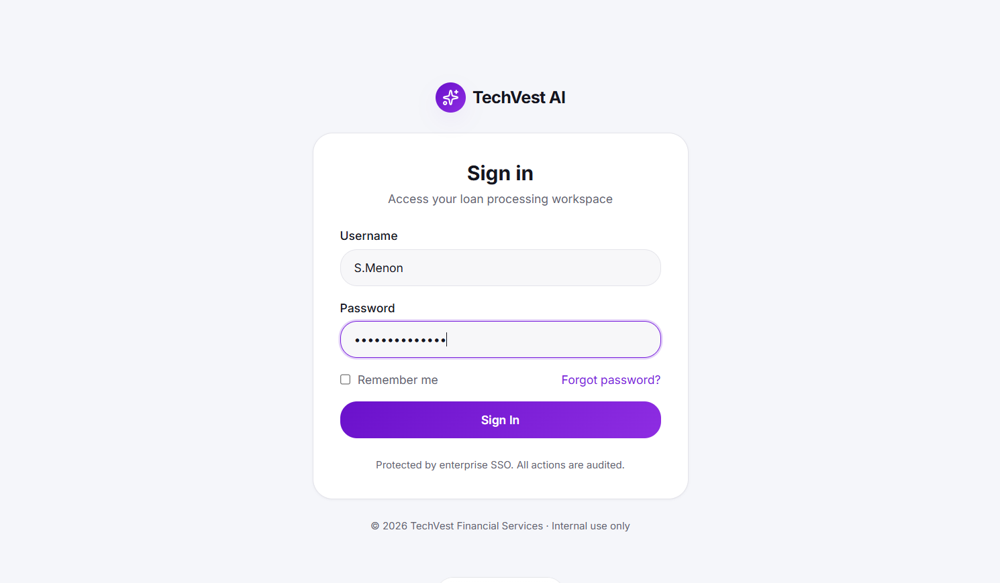

---

## 📊 Operations Dashboard

The dashboard provides an overview of the lending operations with real-time KPIs.

Features include:

- Total Applications
- Pending Reviews
- Approved Applications
- Declined Applications
- Average Decision Time
- Fairness Score
- Audit Compliance

  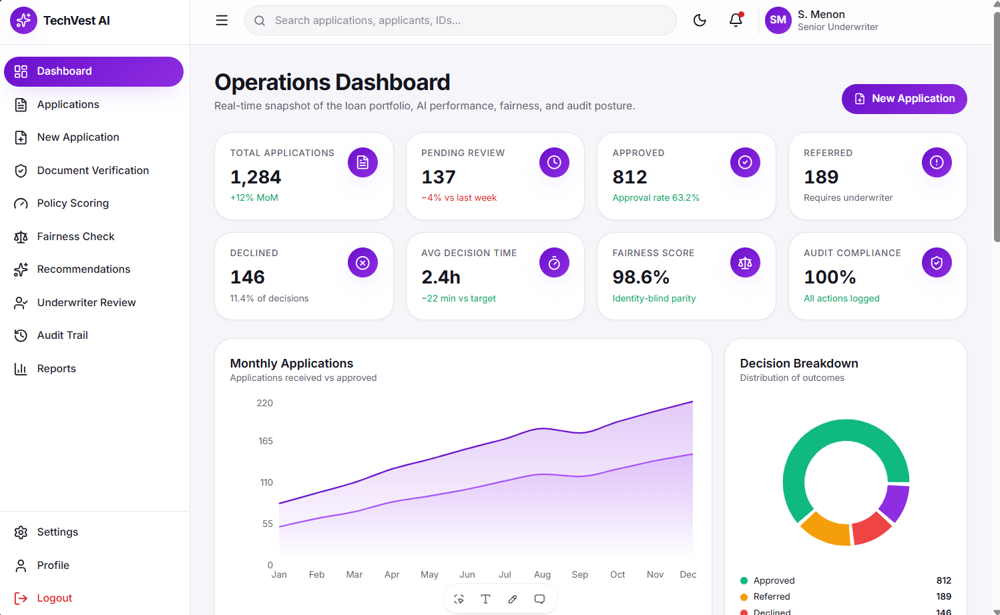

---

## 📈 Analytics Dashboard

Interactive analytics showing approval trends, processing time, application distribution, and operational insights.

  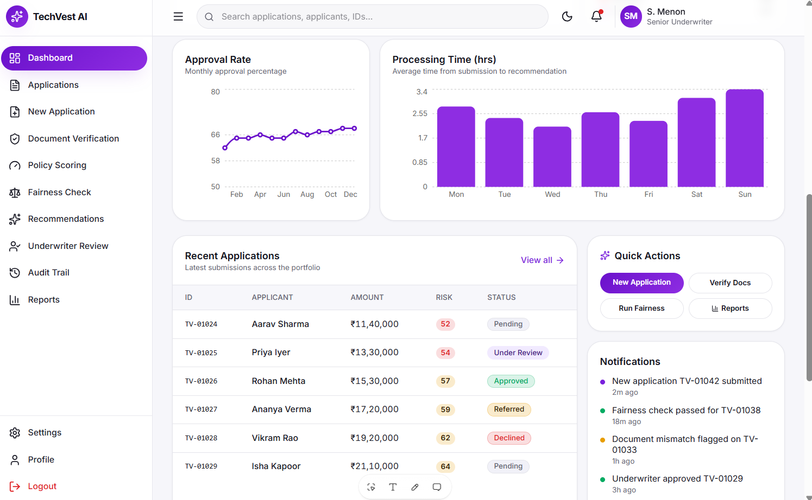

---

## 📂 Loan Applications

Manage all submitted loan applications.

Features:

- Search
- Filters
- Status Tracking
- Loan Details
- Applicant Information

  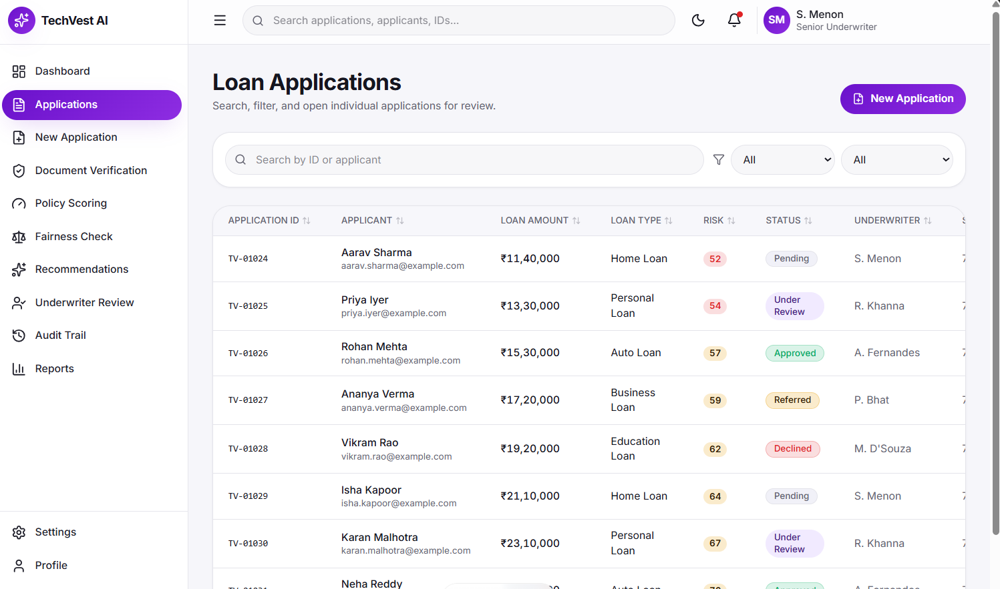

---

## 📑 Document Verification

Automatically validates uploaded documents before loan processing.

Checks include:

- Identity Proof
- Address Proof
- Income Verification
- Missing Documents
- Document Completeness

  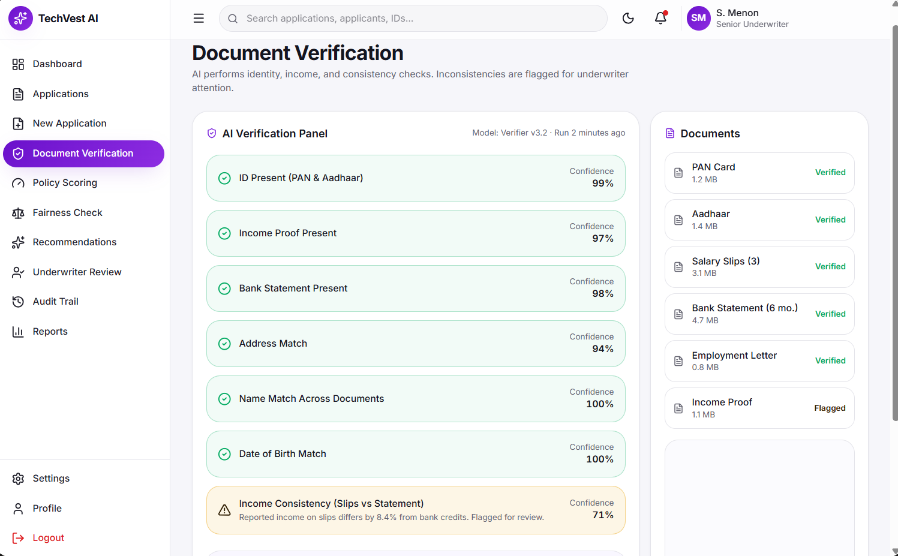

---

## 🎯 Transparent Policy Scoring

Evaluates each application using predefined lending policies.

Scoring Factors:

- Credit Score
- Debt-to-Income Ratio
- Income Stability
- Employment Status
- Risk Assessment

  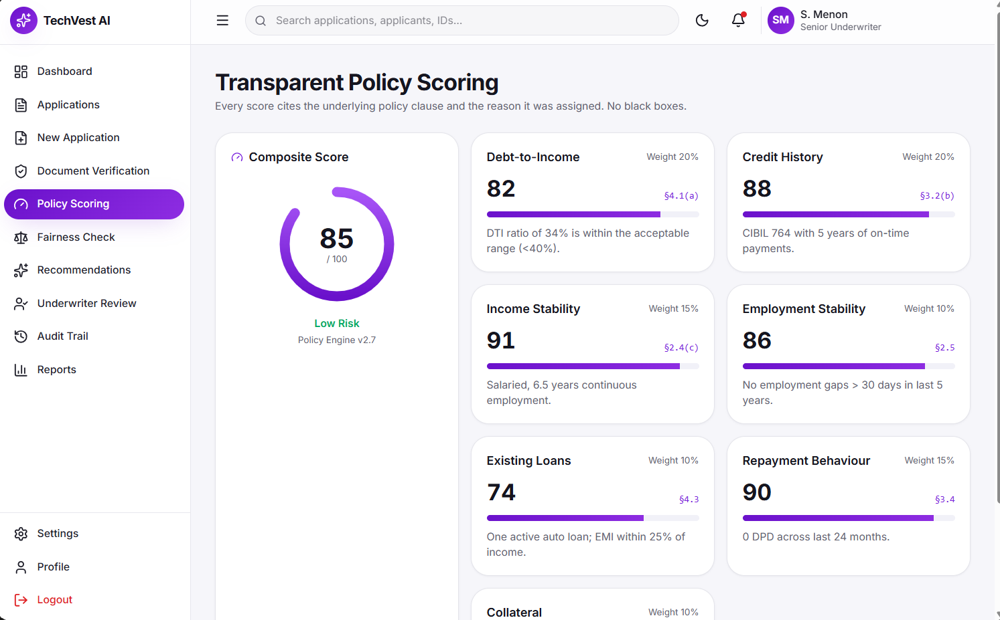

---

## ⚖️ Fairness Check

Ensures lending decisions are transparent, unbiased, and compliant with responsible AI principles.

Features:

- Bias Detection
- Explainable Decisions
- Regulatory Compliance
- Fair Lending Validation

  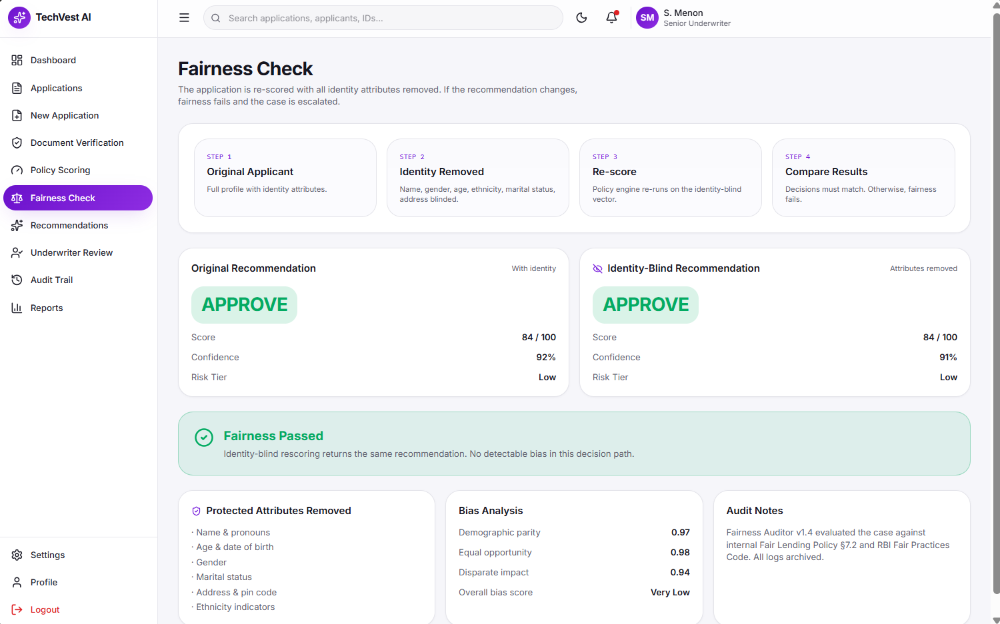

---

## 🤖 AI Recommendation Engine

Google Gemini AI analyzes the application and recommends one of the following:

- Approve
- Refer
- Decline

Also provides:

- Confidence Score
- Risk Level
- Decision Explanation
- Policy Observations

  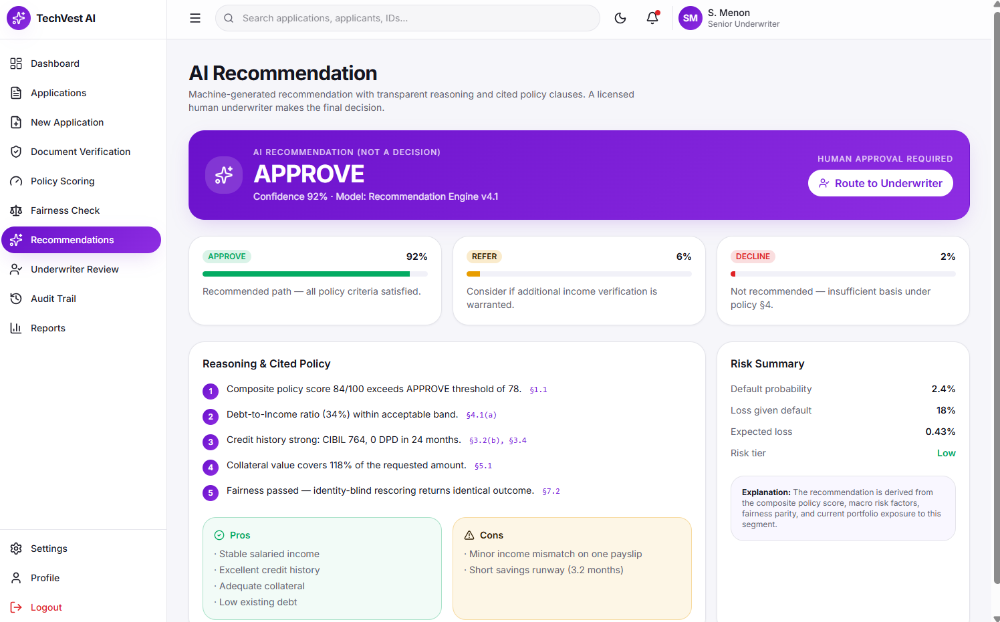

---

## 👨‍💼 Underwriter Review

Human underwriters review AI recommendations before making the final lending decision.

Capabilities:

- Review AI Analysis
- Override Decision
- Add Comments
- Final Approval

  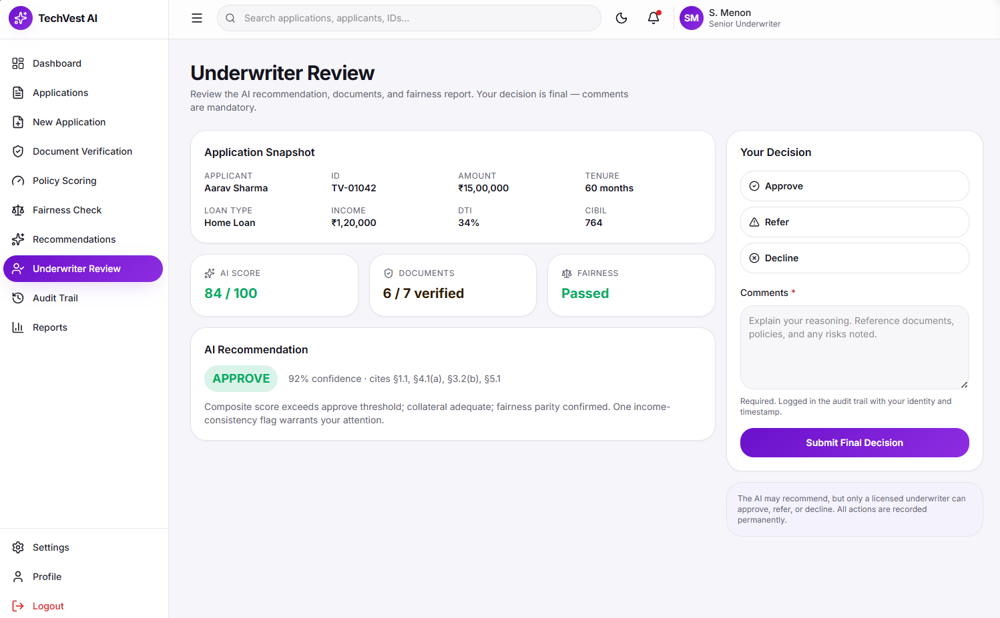

---

## 📝 Audit Trail

Maintains a complete history of every activity performed throughout the application lifecycle.

Logs include:

- User Actions
- AI Decisions
- Policy Checks
- Underwriter Decisions
- Timestamps

  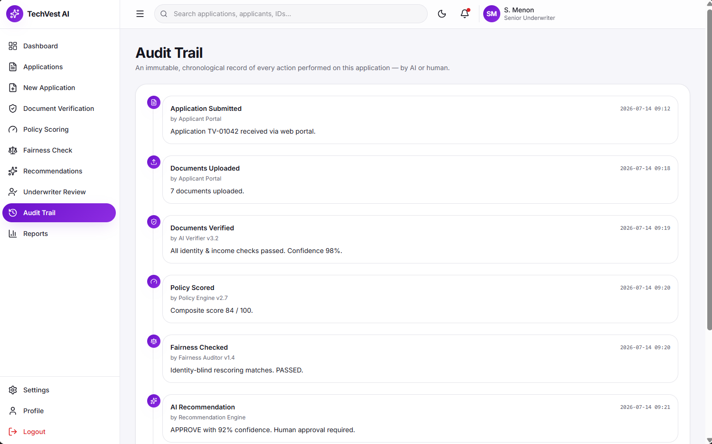

---

## 📊 Reports & Analytics

Generates comprehensive reports for monitoring lending performance.

Available Reports:

- Approval Rate
- Decline Rate
- Fairness Metrics
- Compliance Reports
- Processing Time Analysis

  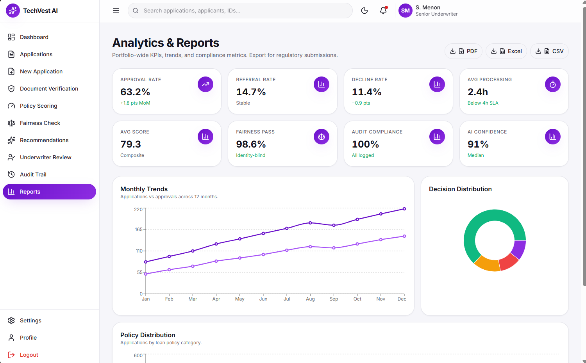

---

## 📈 Performance Dashboard

Provides high-level operational metrics and performance trends for management and stakeholders.

  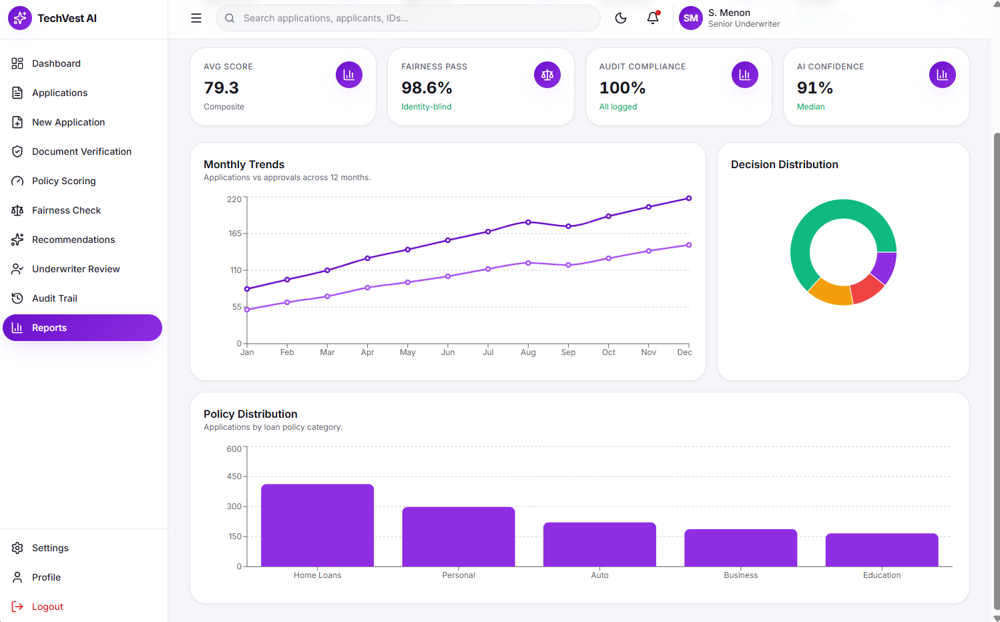

